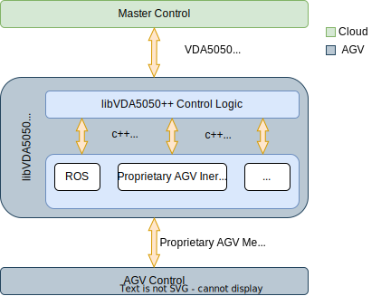

# libVDA5050++

_The current documentation can be viewed [online](http://silicon-economy.pages.fraunhofer.de/services/odyn/vda5050/libvda5050pp)._

libVDA5050++ is a complete and open source implementation of the standard VDA5050 version 2.0.0 ([VDA5050 Github Repo](https://github.com/VDA5050/VDA5050) / [VDA5050 standard v2.0.0](https://github.com/VDA5050/VDA5050/tree/2.0.0)). The aim of the VDA5050 standard is to standardize the interface for communication of automated guided vehicles (AGVs) between the control system and the AGVs. Today's systems are mainly isolated solutions, which means that the control of AGVs is proprietary and therefore manufacturer-specific. This means that AGVs from different manufacturers cannot be controlled by a control system of a specific manufacturer. The VDA5050 standard, which was developed by the German Association of the Automotive Industry (Verband der Automobilindustrie e. V. (VDA)) VDA and Mechanical Engineering Industry Association (Verband Deutscher Maschinen- und Anlagenbau (VDMA)), is intended to overcome this situation. 

The libVDA5050++ offers a open source implementation of the standard, which enables manufacturers of AGVs to quickly align their vehicles with the standard without major effort. The libVDA5050++ offers a MQTT interface to the control system (Master Control Adapter). Furthermore, the library has a lean interface to the vehicle site (AGV Adapter), which can be used to forward upcoming driving maneuvers received via the VDA5050 standard to the vehicle and forward received status information VDA5050-compliant from the vehicle back to the control system. The entire VDA5050 logic is encapsulated within the libVDA5050++.

## What the libVDA5050++ takes care of

List of the most important functionalities of the libVDA5050++:

- Validate Orders (e.g. check if actions are available) and automatically respond with status/error messages if possible
- Keep track of timings (periodic status and visualization messages)
- Supervise AGV navigation (goals, pausing, resuming, stopping)
- Notify AGV about pending actions of the order based on it's position
- Implements a Scheduler for VDA5050 compliant execution of
  actions and navigation goals ([6.2.10](https://github.com/VDA5050/VDA5050/blob/2.0.0/VDA5050_EN_V1.md#-6102-traversal-of-nodes-and-enteringleaving-edges-triggering-of-actions),
  [6.11](https://github.com/VDA5050/VDA5050/blob/2.0.0/VDA5050_EN_V1.md#-611-actionstates))
- Notify AGV / Master Control about certain state changes
- Provide an easy access to the current state
- Process the AGV's position and state

# Installation

You can choose to install the library as a .deb package or simply
include the library via CMake.
Here you can find a guide to install / check all prerequisites to setup the libVDA5050++ on your system: [Installation Guide](install.md) 

# Getting Started

You want to write your own application based on the libVDA5050++? Here is your guide: [Quick Start Guide](quickstart.md) 

# Developer Documentation 

Coming soon.
